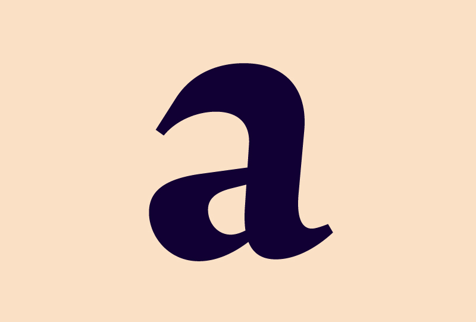

<h1 class="post-title">Introduction</h1>     

By Zeynep Akay

This is the Ruq’ah Project. This site will chronicle the research behind and the design and development of a single-weight, display-oriented, Ruq’ah-inspired typeface with Arabic and Latin components. When complete, this typeface will be added to the Google Webfonts library. 

The beginning of the project lies somewhere in the intersection of my long-time love for the calligraphic style, it being a ubiquitous factor in my MA dissertation research, and the realization that it’s not as frequently visited in typeface design as perhaps other Arabic writing styles — with its potential for robust display type  gone largely unexplored.  From this intersection I turned right and asked my friend Gunnar Vilhjamsson, a Ruq’ah entusiast if there ever was one, for possible places to look for quirkier, more expressive incarnations of the style. He directed me to vintage Egyptian movie posters, and there I found an oasis of inspiration. The microchosm of inventiveness and variety I found in samples of 1950s and 1960s Ruq’ah lettering was incredible.

The next step was to familiarize myself with not just how to calligraphically draw letters but also learn how the writing tradition works as a flowing system. For this I consulted, “Writing Arabic: A Practical Introduction to Ruq'ah Script” by T.F. Mitchell, another suggestion by Gunnar and a seminal 1979 book that still seems to hold court as the go-to resource on the subject. With help from Mitchell, and after many hours scouring the internet for samples like these, I started to sketch what my Ruq’ah would look like. 

I went through a few cycles of sketching and digitizing, each time with a new mutant style, consisting of varying percentages of influence from each attribute and quirk I enjoyed in the very many lettering samples I looked at. At the end of one of the cycles, I sent Dave Crossland a short word composition of a roughly digitized sketch, along with a proposal of my intentions for the project. The proposal outlined not only the design and technical side of development, but also my aim to research and write about some of the existing Ruq’ah typefaces, hoping to get a firm grasp on the style’s challenges and build my version on as strong and as unobjectionable a foundation as possible.

On a more personal note, once the proposal was accepted it became clear that the project would entail tackling some personal challenges as well. For one, the initial set up of this blog, working on Jekyll via git, was difficult. I’m probably one of the very few young(ish) designers clinging for dear life to the WYSIWYG workflows of yesteryear — wanting a more direct connection with the visual design work without getting too much into the nitty gritty. But I recognize the moment in time I am in and that’s why for example, I’ve been flirting with Python programming. It’s also why I’ve decided to embrace a git-hosted blog, instead of a PHP-based custom CMS. I braved through the initial set-up, and now have a grasp on the basic usage of Jekyll, however, the customization of the page was too complicated for me. So I asked a friend to consolidate the Jekyll / Poole framework with the CSS I prepared for the blog.

Another personal challenge, and probably the most important one I will overcome — if the project is successful — is the public development aspect of the project. I battle with crippling perfectionism; I want to keep everything very close-to-chest until I’ve achieved the unattainable ideal in my head. This is why, for example, you cannot find my MATD project on the course’s website; I’ve buried it, deep in the sands of time. But with this project I will undertake what is also essentially immersion therapy. I will open my process, my most unrefined drawings, my kookiest ideas, my most embarrassing failures to the snarkiest , most passive-aggressive comments on the internet. I imagine it will be a terrifying relief.
 
Now that the Project and I are here, this is how I foresee this going down: The written content of The Ruq’ah Project will be categorized as either research articles or design and development updates, all of which will be open to comments and discussion. The language will hopefully be accessible not just to professional type-designers but also to beginners, students and enthusiasts. After the project births its practical output, it will hopefully remain a self-contained, relevant resource for style-specific Arabic type design and development.

After suspending my studies at University of Reading, I inadvertently took a hiatus from type design. I closed myself off from experiencing and engaging with all forms of visual culture.

